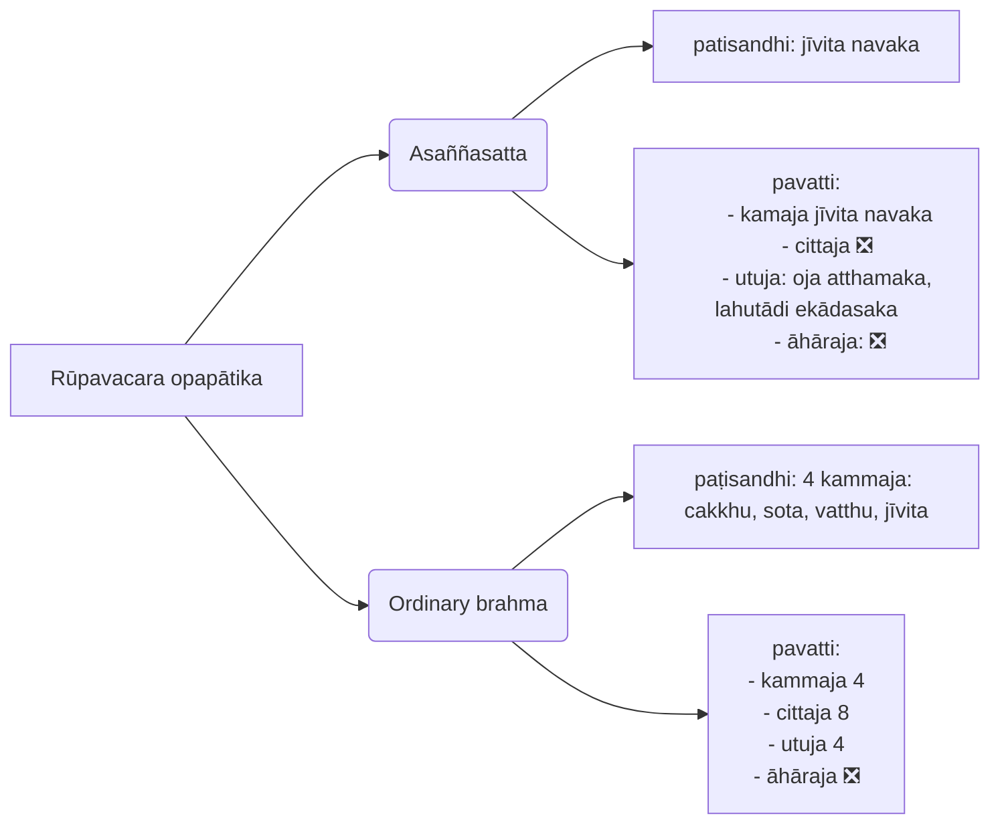

---
tags:
  - fc
  - flashcard
exam note: "[[exam note]]"
pdf: "[[Chapter VI Fundamental Abhidhamma.pdf]]"
---
### general theory:
- classification
	- Rūpa sammaddesa
	- rūpa vibhaṅga
	- rūpa samuṭṭhaṇa
	- rūpa kalāpa : rupa exists in kalāpa as characteristic.
	- rūpa pavattikalāpa
- Rūpa defination
	- Ruppatīti rūpaṃ (saṃyutta)→change through generation.
		- santati ruppana→changing through generation. it need to have **obvious changes** like from solid to liquid or evaporation.
		- kalāpa abhantara→change within kalāpa inself.
	- Rūpayatīti rūpaṃ (mūlatīka)→it manifest by itself. khajjaniyasutta
- rūpa cannot sustain by itself, it need supports from others.

- 18 nipphanna is produced by 4 causes kamma, citta, utu (tejo), āhāra(ojā).
- 18 nipphanna inculdes:
	- 4 mahābhūta
	- 5 pasāda
	- 4 gocara
	- 2 bhāva
	- 1 hadaya
	- 1 jīvitindriya
	- 1 āhāra
- 10 anipphanna is divided into 3 groups:
	-  [[ākāsa dhātu]] 
		- pariccheda rūpa.
		- ajaṭākāsa: (born space) infinite area space.
		- definition.
			- because of ākāsadhātu, we can understand non-self. rūpa is not constant,
			- sometimes, rūpa are attached to each other, which means kālāpa have a boundary, so, it lets each kalāpa not to merge, it is also called ākāsadhātu.
	- [[vikāra rūpa]]:
		- 2 viññatti
		- 3 lahutādi
	- 4 [[lakkhaṇarūpa]]
	 - [[lifespan of each rūpa]]:
		The lifespan of each rūpa, as mentioned in the commentaries, is as follows:
		1. Two viññatti: 1 cittakkhaṇa (one mind-moment) or 3 anucittakkhaṇa (1/3 of a mind-moment).
		2. Upacaya, santati, and aniccatā: 1 anucittakkhaṇa.
		3. Jaratā: 49 anucittakkhaṇa.
		4. The remaining twenty-two rūpas: 17 cittakkhaṇa (17 mind-moments) or 51 anucittakkhaṇa.
>[!summary] lifespan of rūpas
		>1. 2 viññatti: 1 cittakkhaṇa
		>2. upacaya, santati, aniccatā: 1 anucittakkhaṇa.
		>3. jaratā: 49 anucittakkhaṇa.
		>4. remaining 22: 17 cittakhaṇa or 51 anucittakkhaṇa.

# Rūpa vibhaṅga - analysis of corporeality
All rūpas share the following characteristics without any difference: **sasahena sākālopa**
1. [[Sappaccaya]] (saha+paccaya): Rūpas **arise** due to causes.
2. [[Saṅkhata]]: Rūpas are **formed** by causes.
3. [[Ahetuka]]: Rūpas are **not** associated with **roots**.
4. [[Anārammaṇa]]: Rūpas do **not perceive** objects.
5. [[Sāsava]]: Rūpas are objects of **cankers**.
6. [[Kāmāvacara]]: Rūpas are objects of **sensual craving**.
7. [[Lokiya]]: Rūpas belong to the **worldly** (mundane) sphere.
	lujjati, palujjati: destroy, break apart.
8. [[Appahātabba]]: Rūpas are **not** to be **abandoned**.
   
**mnemonic**: causes formed roots object crankers sensual world abandon
## [[Rūpa Classification]] 
1. **ajjhattika**: 5 pasāda, *citta*.
2. **vatthu**: viññāṇa & kilesa. 5 pasāda + hadaya.
3. **dvāra**: viññāṇadvāra: 5 pasāda, *citta*. kammadvāra: kāyaviññatti, vacīviññatti, **javana** (33citta).
4. **indriya**:(8) 5pasāda, 2bhāva, jīvindriya
5. **sappaṭigha**:(12) 5pasāda + 7gocara (-āpo).
6. **oḷārika**: (12) = sappaṭigha
7. **santike**: = (12) = sappaṭigha
8. **upādinna**: cling. 18 kamma born
9. **Sanidassana**: (1) vaṇṇarūpa.
10. **Gocaraggāhika**: taking object. 5 pasāda. sampatta(-cakkhu, -sota)
11. **vinibbhoga**: 8 common rūpa.

# Rūpa Samuṭṭhāna
4 major causes of rūpa:
1. kamma - cetanā
2. citta
3. utu
4. āhāra (oja)

### Kamma:
cetanā that cannot produce result in the  future:
1. 4 magga: nāmarūpa virāga bhāvanā
2. 4 arūpa kamma: because it is called rūpa virāga
3. 25 cetanā envolve in producing kamaja rūpa

sotapattimagga abandon resultant from 7th life.
sakadaggami from 2 life to 7th
...
higher magga sharpen faculty to cut off resultant.

> The cetanā cetasika of the **twenty-five kamma cittas,** including twelve akusala cittas, eight mahā kusala cittas and five rūpāvacara kusala cittas, **can produce rūpas.** The rūpas produced by these cittas are called kammajarūpas. Kammajarūpas arise in living beings (except those in the arūpa realm) **from the moment of paṭisandhi (rebirth-linking) until the 17th mind moment preceding death (except last vīthi - first citta of last vīthi)**. Kammajarūpas arise in living beings at every sub-mind moment. However, kammajarūpas do not arise in inanimate bodies. **Divine mansions obtained by devas due to their past merits consist of utujarūpas** (matter born out of tejo dhātu) supported by kamma (kammappaccaya-utusamuṭṭhāna). Since the arūpa bhūmi is not a location for rūpas, arūpāvacara kusala cetanā does not produce kammajarūpas.

> [!NOTE] Summary:
>- kammaja is produced by cetanā of **25 cittas**: 12 akusala,  8 mahaggata kusala, 5 rūpa kusala.
>- kammaja rūpa is only in animated beings, except in arūpa realms, it exists from paṭisandhi to the 17th mind moment preceding cuti.
>- kamaja does not exist in inanimate beings, so divine mansions are utujarūpa supported by kamma.
### citta
cittas that can produce cittaja rūpa:
89 - 14 cittas = 75 cittas.
14 cittas: 4 arūpavipaka, 10 viññāṇa (because it is too weak to produce cittaja)
citta arise in the whole body, not only in any part.

| 75 cittas | not |
| ---- | ---- |
|  | 1. viññāṇa 10 because no vitakka and jhānaṅga 2.   |
|  | 2. arūpa vipāka 4 a, carimaka citta (13 )  |

>The **seventy-five** consciousnesses, **excluding the four arūpāvacara vipāka cittas and the dvipañca viññāṇa**, can produce corporeality. These consciousnesses give rise to rūpa like a mushroom that emerges with some soil on its top. **Consciousness produces corporealities during its genesis.** It does not produce rūpa during its persisting moment and dissolving moment since it is weak during those moments. **(The  strongest moment)**. The corporeality produced by the mind is called cittaja-rūpa (mind-born matter). **However, arūpa vipāka cittas do not produce cittaja rūpas** as the immaterial sphere is not a place for rūpa to arise. The other consciousnesses that occur **in the immaterial sphere also do not produce corporeality when they arise in those realms**. The dvipañca viññāṇa do not produce corporeality because it is weak. Furthermore, the rebirth consciousness of all beings and the death consciousness of Arahants do not produce corporeality. There is a difference of opinion among some teachers regarding whether the death consciousness of all beings produces corporeality; according to them **death conciousness of every being do not produce cittaja rūpas**. Mind-produced matter begins to arise in one's life with the arising of the first bhavaṅga citta after the paṭisandhi citta. The four arūpa vipāka cittas, dvipañca viññāṇa, **paṭisandhi citta of all beings, and the cuti citta of Arahants** do not produce corporeality.

> [!NOTE] **Summary:**
> - 75 cittas can produce cittajarūpa: except arūpa-vipāka, dvipañca-viññāṇa. paṭisadhi and cuti of arahants are also substitutions here.
>- citta produce cittaja during its genesis. (persisting and dissolving moment is too weak)
>- cittas arise in arūpa realms cannot produce cittajarūpa.
>- cittaja starts to arise from the first bhavaṅga after paṭisandhi.

#### Physical and verbal actions and maintaining the postures
1. change the posture can maintain the posture.
	- 29 kāma javana:
		- 12 akusala
		- 1 hasituppāda
		- 8  mahā kusala
		- 8 mahā kiriya
	- 1 manodvārāvajana
	- 2 abbiññāṇa
		in **manodvarā vīthi**.
		because these can produce viññatti.
2. maintain posture cannot change.
	26 appaṇā javana.
	- 5 rūpa kusala, 5 rūpa kiriya.
	- 4 arūpa. kusala, kiriya
	- 8 lokuttara.
	voṭṭhapana, 29  kāmajavana, 11 tadālambanna in **pañcadvāravīthi**.
3. neither maintain nor change.
	- bhavaṅga.
	- pañcadvārāvajjana, 2 sampaṭicchana, 3 santīraṇa,  in **pañcadvāravīthi**. (15)

>The body does not move automatically, and the **immaterial consciousness is also incapable of moving the body**. All bodily activities such as walking, running, standing, and moving limbs occur with the power of cittaja rūpas.
Moreover, it is with the power of cittaja rūpas that the body of a standing person remains erect without falling and the body of a seated person remains in place. Among the seventy-five consciousnesses that produce corporeality, the twenty-six appaṇā javana cittas not only produce cittaja rūpas but also maintain the postures made by previous consciousnesses. The mind-born corporealities produced by appaṇā javana are not capable of moving the body; their function is to maintain the postures made by previously arisen cittaja rūpas.
The mind-produced corporeality produced by the bhavaṅga cittas cannot perform the function of maintaining postures. That is why a person who is seated or standing will fall if they fall asleep.
The thirty-two consciousnesses comprising the votthapana citta, twenty-nine kāma javana cittas, and the two abhiññāṇa cittas not only produce cittaja rūpas and maintain postures but also produce kāyaviññatti (bodily intimation) and vacīviññatti (verbal intimation). Deliberate physical and verbal actions occur due to physical and verbal intimation.

> [!NOTE] Summary
> - 26 appaṇājavana cittas only maintain posture.
> - bhavaṅga cittas cannot even maintain posture.
> - 32 cittas: votthapana, 29 kāmajavana, 2 abhiññāṇa can either maintain posture, or produce kāyaviññatti, vacīviññatti for body movement.

#### Smile
**13 cittas**:
- four somanassa sahagata lobhamūla cittas, 
- four somanassa sahagata mahā kusala cittas, 
- four somanassa sahagata mahā kiriya cittas, 
- somanassa sahagata hasituppāda citta

| # | Being | Smile producing consciousnesses |
| ---- | ---- | ---- |
| 1 | Puthujjana **8** | Somanassa lobhamūla 4 Somanassa mahā kusala 4 |
| 2 | Sekkha **6** | Somanassa diṭṭhigata vippayutta lobhamūla 2 Somanassa mahā kusala 4 |
| 3 | Arahants and Paccekabuddhas **5** | Somanassa mahā kiriya 4 Hasituppāda 1 |
| 4 | Sammāsambuddhas **3** | Somanassa ñāṇa sampayutta mahā kiriya 2 Hasituppāda 1 |
### Utu
>During the **persisting phase (ṭithi kāla)**, **tejo** dhātu in rūpa kalāpas produces new rūpas. These rūpas are called utujarūpas, as utu is a synonym for tejo dhātu. Tejo dhātu is present in every rūpakalāpa. Therefore, rūpakalāpas **produced by every major cause produce utujarūpas** during the persisting phase. 1 Rūpas are **stronger during the ṭitikāla**, so they do not produce new matter during the phase of genesis.

normally 1 kalāpa only does 1 major cause, others may support.
but to produce utujarūpa, there are:
- from kammaja 8-10 generations
- aharaja: 10-12 gens
- cittaja: 2-3 gens
- utuja: many gens.
exception: if the generation is exhausted, it cannot produce a new generation.
### Āhāra
>Āhāra rūpa, found in kālāpas in food and beverages, when inside the body, **produce new kalāpas during their persisting stage**. These rūpas are called āhāraja rūpas. Ojā (nutriment) is found in all kalāpas that **constitute body parts such as flesh, sinews, blood, etc**. Ojā found in food kalāpas and body kalāpas interact with each other and produce āhāraja rūpas. **Ojā in food cannot produce āhāraja rūpas without the help of ojā in the animate body**. Similarly, ojā in bodies is also unable to produce āhāraja rūpas without the support of ojā in food.
>There is an opinion among some teachers that ojā in food taken in **can only assist the ojā inside the body in producing corporeality but does not produce corporeality by itself.**
>It has been said that not only the food consumed but even food applied on the body produces corporeality, and the food consumed by the mother produces corporeality in the fetus.

# Lesson 6.9 Rūpas Produced by Each Major Cause

| kamma | citta | utu | āhāra |
| ---- | ---- | ---- | ---- |
| 5 pasāda | 2 viññātti |  |  |
| 2 bhāvarūpa | 1 sadda | 1 sadda |  |
| 1 Jīvitindriya | lahutādi | lahutādi | lahutādi |
| hadayavatthu |  |  |  |
| 8 avinibbhoga | 8 avinibbhoga | 8 avinibbhoga | 8 avinibbhoga |
| 1 ākāsadhātu | 1 ākāsadhātu | 1 ākāsadhātu | 1 ākāsadhātu |
| **total: 18** | **15** | **13** | **12** |
| 20 | 17 | 15 | 14 |
| ekanta kammaja: 5+2+1+1 = 9 | ekanta cittaja: 2 viññātti |  |  |
according to dhammasaṅgaṇī, upacaya and santati are included in arising state of all kalāpa, so each total number is added 2 more.
according to suttanta, all 4 are included in all kalāpa.

produced by:
- 1 cause (ekaja): ekanta kammaja + ekanta cittaja = 11
- 2 causes (dvija): 1 sadda
- 3 causes (tija): 3 lahutādi
- 4 causes (catuja): 9 avinibbhoga+ākāsadhātu
- 0 causes (nakutocija): 4 lakkhaṇādi.

# Lesson 6.10 Rūpa Kalāpa (I) 
Corporeality Clusters (I)
paramāṇu: atom, smallest size (36 paramāṇu = 1 aṇu)

![[paccaya-support.excalidraw]]

There are four characteristics, or lakkhaṇas, of a rūpa kalāpa:
1. Ekuppāda: All rūpas in a kalāpa arise together.
2. Ekanirodha: All rūpas in a kalāpa vanish together.
3. Ekanissaya: All rūpas in a kalāpa share the same dependence of 4 great elements.
4. Sahavutti: All rūpas in a kalāpa exist together

# Lesson 6.11 Rūpa Kalāpa (II) Corporeality Clusters (II)

Rūpa kalāpas are formed according to a specific pattern, resulting in a total of twentythree different types. These twenty-three kalāpas are classified as follows:
1. Nine kammaja kalāpas
2. Eight cittaja kalāpas
3. Four utuja kalāpas
4. Two āharaja kalāpas

### Kammaja Kalāpa:
every kammaja kalāpa contains 8 avinibbhoga  and 1 jīvitindriya
1. cakkhudasakakalāpa: 9 + cakkhupasāda
2. sotadasaka: 9+sotapasāda
3. ghānasasaka:
4. jivhādasaka
5. kāyadasaka
6. itthibhāvadasaka
7. pumbhāvadasaka
8. vatthudasaka: 9+hadayavatthu
9. jīvitanavaka

### cittaja kalāpa
8 avinibbhoga
1. Ojā aṭṭhamaka kalāpa
2. saddanavaka: sound as the ninth.
3. kāyaviññattinavaka
4. vaciviññattisadda-dasaka. **these 4 + lahutādi**
5. lahutādi-ekadasaka
6. saddalahutādi-dvādasaka
7. kāyaviññattisalahutādi-dvadasaka
8. vaciviññattisaddalahutādi-tedasaka
**in abhidhammatthasaṅgaha: 2, 6 is missed, but existed in** visudhimagga  as ānāpāna sound.

### Utuja Kalāpa
1. (Utuja) Ojā-aṭṭhamakakalāpa 
2. (Utuja) Saddanavakakalāpa
3. (Utuja) Lahutādi-edādasakakalāpa
4. (Utuja) Saddalahutādidvādasakakalāpa
### Āharaja Kalāpa
1. (Āhāraja) Ojā-aṭṭhamakakalāpa: 
2. (Āhāraja) Lahutādi-edādasakakalāpa

#  Lesson 6.12 Rūpappavattikkama (I) Occurrence of Matter (I)

4 Yoni:
1. **aṇḍaja**: egg born
2. **jalābuja**: womb born
3. **saṃsedaja**: moisture-born. usually born in dirty area, except uppalavaṇṇa born from lotus flower.
4. **opapātika**: spontaneously born. Devas, brahmas
aṇḍaja, jalābuja is collectively referred to as **gabbhaseyya**.

1 idea: aṇḍaja have 2 birth (dija), lay egg, 2nd is inclubated egg 

### Kāma Realm:
pavatti kāla: all kalāpa (23)
paṭisandhi:
#### 1. saṃsedaja and Opapātika
	![[samsedaja 2024-01-16 15.53.13.excalidraw]]
	pavatti: 
		all 8 kammaja, 1 being only have 1 bhāva.
		cittaja 8
		utuja 4
		āhāraja 2
#### 2. Gabbaseyyaka
(aṇḍaja +  jalabuja)
patisandhi:
	3 kammaja kalāpa (kayādasakam  vatthu dasaka, bhāva dasaka)
	exception: lack of bhāva
pavatti:
	all 8 kāmaja, 8 cittajam 4 utuja, 2 āhāraja
	77th night, 11th week, of a  human cakkhu, sota, ghāna, jivhā pasāda is developed.

### 3. Rūpa Realm
all being are  opapātika

Asaññatta:
	patisandhi: jīvita navaka
	pavattati:
	- kamaja jīvita navaka
	- cittaja ❎ 
	- utuja: oja atthamaka, lahutādi ekādasaka
	- āhāraja: ❎ 
Ordinary Brahma:
	paṭisandhi: 4 kammaja (cakkhu, sota, vatthu, jīvita)
	pavatti: 
		- kammaja 4
		- cittaja  8
		- utuja 4
		- āhāraja ❎ 

Paṭisandhi:
	- dvihetuka, tihetuka have all faculty.
	- 1 being only have 1 bhāva at the same time.
	- every being in kāma realms never lacks jivha.
	- no opapātika who lacks  ghāna pasāda.
	- in kāma realm, sugati opapātika will have all faculty
	- gabbhaseyyaka only get 3 kammaja kalāpa
	- during pavatti, they can  get  22 kalāpa (all)
asañña being
- don't have cittaja kalāpa
- don't have utuja-kalāpa with sound
- only jīvita in kammaja.

# Lesson 6.13 Rūpappavattikkama (II) Occurrence of Matter (II)

1. Kammaja rūpas start to arise in all beings from the **moment of paṭisandhi** citta (first consciousness in life).
2. Cittaja rūpas start to arise **from the arising moment** of the second citta (first bhavaṅga citta).

3. Utuja rūpas start to arise from the **persisting moment (ṭhiti kāla) of the paṭisandhi** citta.
4. Āhāraja rūpas start to arise from the moment the essence of **food starts to circulate** in the body.
5. The specific **timing** of when jīvita **navaka kalāpas** start to arise in the bodies of living beings is **not mentioned**.

###  Occurrence of Kammaja Rūpas
![[Drawing 2024-01-18 10.09.19.excalidraw]]

kammaja:
correct page 28: 146 -> 147, 151 -> 153

**extra types of utujarūpa**
gabbhaseyya have a special utuja that is core. it build up our body:
- from mother
- from father
- from food consumed by the mother
- from food consumed by himself.
3rd type of utu is from weather, it lasts for only 3 generations.

# Lesson 6.14 Rūpas in Each Realm

| # | Realm | Rūpas that airse in the realm |
| ---- | ---- | ---- |
| 1 | Kāma bhūmi | All 28 rūpas |
| 2 | Ordinary rūpa bhūmi | 23 rūpas except ghānappasāda, jivhāppasāda, kāyappasāda and 2 bhāvarūpas, |
| 3 | Asaññasatta bhūmi | 17 rūpas except 5 pasāda rūpas, 2 bhāva rūpas, 2 viññatti, hadayavatthu and sadda rūpa. |
| 4 | Arūpa bhūmi | No rūpa |
#  Lesson 6.15 Rūpa Nirodha Cessation of Matter in Living Beings
- all kammaja must stop after the cuti moment.
- living could not live without kammaja rūpa.
- because kammaja stop, cuti citta arise after 17 mind moments.
The process of the generation of rūpas ends at the conclusion of each life in the following manner:
1. For a living being, the last kammaja rūpas arise simultaneously with the seventeenth mind moment preceding death. Kammaja rūpas do not arise at the ṭhiti moment of the seventeenth mind moment before death and thereafter. The kammaja rūpas that arose together with the seventeenth mind moment before death cease to exist after the final consciousness of that life (cuti citta). 4 This cessation of the arising of kammaja rūpas is not a result of any power or effect of the cuti citta. Once the kammaja rūpas have ceased to arise, only sixteen new cittas can arise based on the physical body. The final citta among the sixteen is known as the cuti citta.

2. Following the cuti citta, no consciousness arises within the body since there are no vatthu rūpas for the csy not arising, cittaja rūpas also do not arise. The final cittaja rūpas of the body, which arose with the cuti citta of a non-Arahant, cease to exist after sixteen mind moments subsequent to the vanishing of the cuti citta.

3. As there is no jīvitindriya rūpa after death, no āhāraja rūpa emerges in the deceased body.

4. Only the utuja rūpa generations persist for a longer duration within the corpse.

asannakamma (death proximate cause) is kamma done before the last mind moment.
**kāyassa:  4 types**:
1. ekajakāya: only 1 type of rūpa.
2. dvījakāya: 2 types of rūpa.
3. tijakāya: 3 types of rūpa.
4. catujakāya: 4 types of rūpa.

**rūpa produced by  causes**: (kmj, cj, uj, āj)
ekajarūpa, dvījarūpa, tijarūpa, nakutocija. != jakāya.

paṭisandhi don't produce cittajarūpa.
- the arising moment  is ekajakāya
- ṭithi, bhaṅga moment is dvījakāya: kammaja + utuja
- next  mind moment, arising moment is tijakāya: kammaja + cittaja, utuja.
- after eating, catukakāya.
- every sub-mind moment, kammaja rūpa arises.

![[WhatsApp Image 2024-01-21 at 16.37.36.jpeg]]

![[WhatsApp Image 2024-01-21 at 16.37.37.jpeg]]

![[WhatsApp Image 2024-01-21 at 16.37.42.jpeg]]

![[WhatsApp Image 2024-01-21 at 16.37.44.jpeg]]

![[WhatsApp Image 2024-01-21 at 16.37.45 (1).jpeg]]

![[WhatsApp Image 2024-01-21 at 16.37.45.jpeg]]

![[WhatsApp Image 2024-01-21 at 16.37.46 (1).jpeg]]

![[WhatsApp Image 2024-01-21 at 16.37.46.jpeg]]

![[WhatsApp Image 2024-01-21 at 16.37.47 (1).jpeg]]

![[WhatsApp Image 2024-01-21 at 16.37.47.jpeg]]

![[WhatsApp Image 2024-01-21 at 16.37.48 (1).jpeg]]

![[WhatsApp Image 2024-01-21 at 16.37.48 (2).jpeg]]

![[WhatsApp Image 2024-01-21 at 16.37.48.jpeg]]

![[WhatsApp Image 2024-01-21 at 16.37.49 (1).jpeg]]

![[WhatsApp Image 2024-01-21 at 16.37.49.jpeg]]

![[WhatsApp Image 2024-01-21 at 16.37.50 (1).jpeg]]

![[WhatsApp Image 2024-01-21 at 16.37.50.jpeg]]

![[WhatsApp Image 2024-01-21 at 16.37.51 (1).jpeg]]

![[WhatsApp Image 2024-01-21 at 16.37.51.jpeg]]

# Lesson 6.16 The Nibbāna

**nirodha**:
1. khaṇika, santati nirodha
	khaṇika is the moment not arising after passing away, or the moment passing.
	santati could be in 1  generation or lifespan. depend on object talking.
2. anuppanna nirodha: not arising again.

![[PHOTO-2024-01-22-10-49-08.jpg]]
![[PHOTO-2024-01-22-10-49-09.jpg]]![[PHOTO-2024-01-22-10-49-09 1.jpg]]![[PHOTO-2024-01-23-16-43-51.jpg]]![[PHOTO-2024-01-23-16-43-51 1.jpg]]![[PHOTO-2024-01-23-16-43-52.jpg]]

| upada | nirodha |
| ---- | ---- |
| khaṇika upāda | khaṇika nirodha |
| santati upāda | santati nirodha |
| anuppanna upāda | anuppanna  nirodha |
**thing  that will happen in futher, should "consider as arisen"**
why, because causes for that "arisen" are still there.
to get rid of anuppanna upāda, we need to remove the hetu for that arisen, here, avijja is mentioned.
taṇha is removed by removing avijja, it cannot be removed alone.
