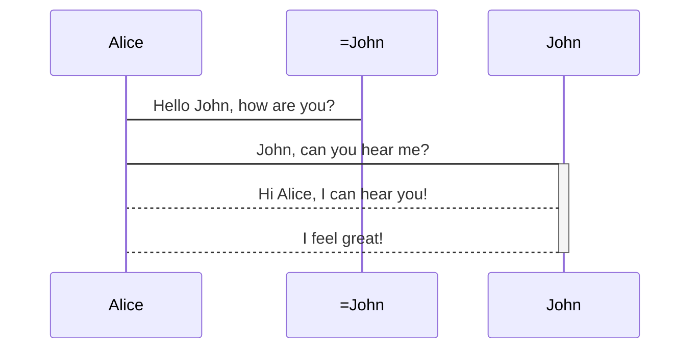
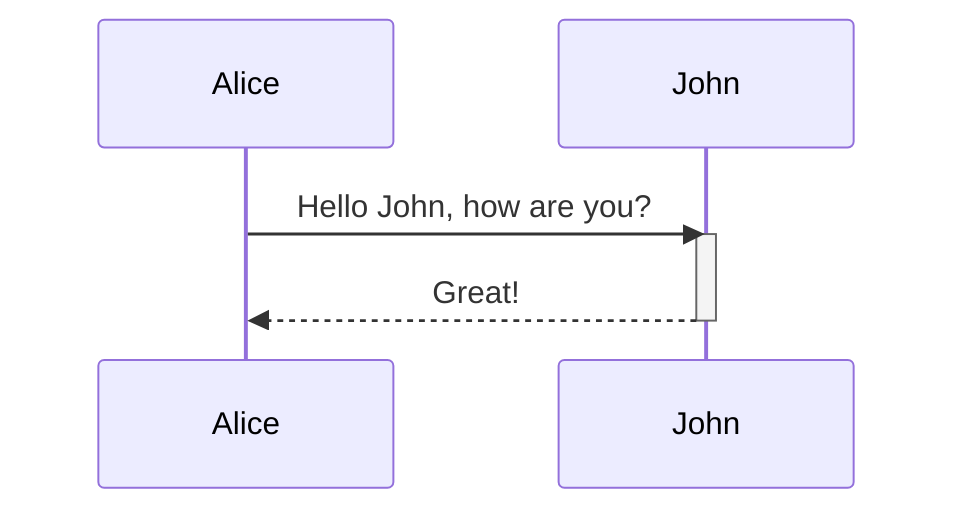
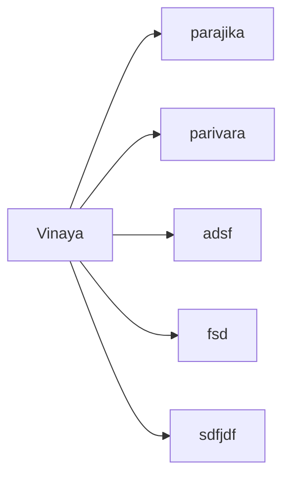
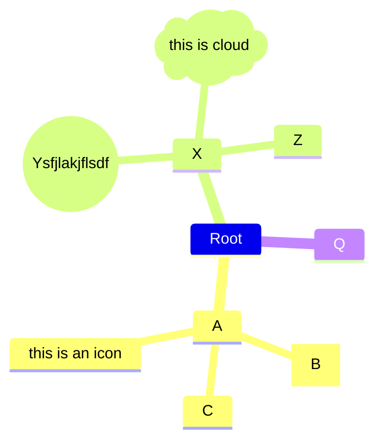
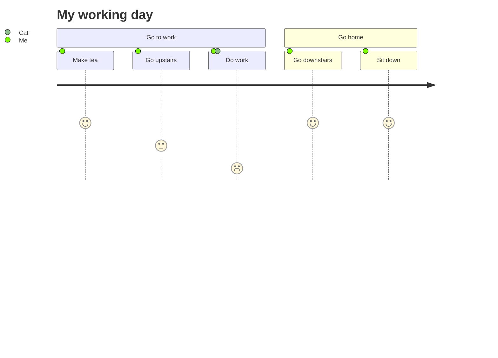

---
tags:
  - "#markdown"
  - cheatsheet
---
<!--ID: 1703218553052-->


| Element         | Markdown Syntax                                     |
| --------------- | --------------------------------------------------- |
| Heading         | `# H1   ## H2   ### H3`                             |
| Bold            | `**bold text**`                                     |
| Italic          | `*italicized text*`                                 |
| Blockquote      | `> blockquote`                                      |
| Ordered List    | `1. First item   2. Second item   3. Third item   ` |
| Unordered List  | `- First item   - Second item   - Third item   `    |
| Code            | `` `code` ``                                        |
| Horizontal Rule | `---`                                               |
| Link            | `title`                                             |
| Image           | ``              |

## Extended Syntax[](https://www.markdownguide.org/cheat-sheet/#extended-syntax)

These elements extend the basic syntax by adding additional features. Not all Markdown applications support these elements.


|Element|Markdown Syntax|
|---|---|
|Table|`\| Syntax \| Description \|   \| ----------- \| ----------- \|   \| Header \| Title \|   \| Paragraph \| Text \|`|
|Fenced Code Block|` ```   {     "firstName": "John",     "lastName": "Smith",     "age": 25   }   ``` `|
|Footnote|`Here's a sentence with a footnote. [^1]      [^1]: This is the footnote.`|
|Heading ID|`### My Great Heading {#custom-id}`|
|Definition List|`term   : definition`|
|Strikethrough|`~~The world is flat.~~`|
|Task List|`- [x] Write the press release   - [ ] Update the website   - [ ] Contact the media`|
|Emoji  <br>(see also Copying and Pasting Emoji)|`That is so funny! :joy:`|
|Highlight|`I need to highlight these ==very important words==.`|
|Subscript|`H~2~O`|
|Superscript|`X^2^`|






$e^{2i\pi} = 1$
$x^y$
$x_i^2 + 2*x_1^3$
$\sqrt x / 3$
$$
(\frac{\sqrt x} {y^3})
$$

$\sum_1^100 3x^3+2x+1$

$\_2^x$




types of callout:
- note (blue)
> [!note] > Lorem ipsum dolor sit amet


- abstract, summary, tldr (green)
>[!tldr]- header
>Long Content that needs to hide goes here.
- info (blue)
>[!info] info
- todo (blue)
>[!todo] info
- tip, hint, important (sky blue)
>[!tip] info
- success, check, done (green)
>[!done] info
- question, help, faq (yellow)
>[!question] info
- warning, caution, attention (orange)
>[!warning] info
- failure, fail, missing (red)
>[!fail] info
- danger, error (red)
>[!danger] info
- bug (red)
>[!bug] info
- example (purple)
>[!example] info
- quote, cite (grey)
>[!quote] info

